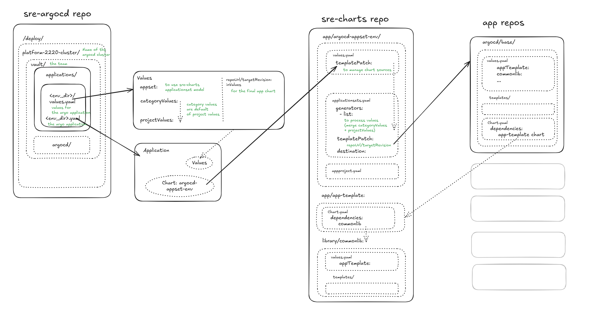

<a href="https://vault-stg3.aws.stg.ldg-tech.com/">
    
</a>

# Vault

[](https://argocd.aws.prd.ldg-tech.com/applications/argocd/VAULT-APP-GATE-ARGOCDTEST5-COMPONENTS-STG3?resource=)

## Table Of Content

- [Vault](#vault)
  - [Table Of Content](#table-of-content)
  - [Defining environment](#defining-environment)
  - [Adding a new Gate](#adding-a-new-gate)
    - [Yaml configuration](#yaml-configuration)
    - [Onboarding](#onboarding)
    - [Common errors or mistakes](#common-errors-or-mistakes)
      - [CompartmentID](#compartmentid)
      - [Wrong scripts](#wrong-scripts)
  - [Tips N Tricks](#tips-n-tricks)
    - [Set the imageTag with TargetRevision](#set-the-imagetag-with-targetrevision)
    - [Nuke some DB](#nuke-some-db)
  - [SRE part](#sre-part)

## Defining environment

All the environment related configuration are centralized into a [single file](main.yaml).
It allow us to simply declare the detail about the cluster, the namespaces, labels and values file.
This env should be listed in [kustomization.yaml](kustomization.yaml)

<details>
<summary>
  Example
</summary> <br />

```yaml
---
apiVersion: argoproj.io/v1alpha1
kind: Application
metadata:
  name: vault-main
  annotations:
  finalizers:
    - resources-finalizer.argocd.argoproj.io
  labels: &labels
    environment: main
    owner: team-infra-sre
    project: "2063"
    organization: enterprise
    service: vault
spec:
  project: vault-argocd
  sources:
    - repoURL: https://github.com/LedgerHQ/sre-argocd.git
      targetRevision: main
      ref: values
    - repoURL: ghcr.io/ledgerhq/charts
      chart: argocd-appset-env
      targetRevision: "0.9.5"
      helm:
        passCredentials: true
        valueFiles:
          - "$values/deploy/platform-2220-cluster/applications/vault/main/values.yaml"
        valuesObject:
          labels: *labels
          destination:
            name: shared-application-2021-cluster
            namespace: 2063-vault-main
  destination:
    name: in-cluster
    namespace: argocd-central
  syncPolicy:
    automated: {}
    syncOptions:
      - Validate=true
      - ServerSideApply=true
```
</details>

## Adding a new Gate

### Yaml configuration
Make sure that the categoryValues has base `gates` section. e.g.:
<details>
<summary>
  Shared gate values
</summary><br />

```yaml
    gates:
      repoUrl: https://github.com/LedgerHQ/ledger-vault-api
      path: argocd/base
      inlineValues:
        image:
          tag: 8.0.40
        custom:
          calVersion: 2024.28.2399
        env:
          VAULT_HSM_SCRIPTS_VERSION: "13.0.9-dave+bd0b7d55"
          VAULT_ATTESTATION_ID: 1
...
```
</details>

Then, to add a new gate, you should first add a new "gate section" into the preset under `projectValues.gates`:

<details>
<summary>
  Gate section to add
</summary> <br />

```yaml
      gate-test:
        inlineValues:
          env:
            VAULT_COMPARTMENT_ID: 1111
```
</details>

### Onboarding

To onboard the new gate, you can use the following url (example for `main` env):
https://vault-main.aws.stg.ldg-tech.com/test/onboarding/state

Or you can also use [vault-cli](https://vault-guide.ldg-tech.com/docs/tools/vault-cli) to onboard a new gate with the following command line (example for `main` env):

```ledger-vault bake beatles --retry 3 --gate https://vault-main.aws.stg.ldg-tech.com/gate/test  --compartment 1111 --hsm https://ci.hsmsaas3-ci.ledger-stg.com/releases/0/process --deviceAPI https://vault-device-api-main.aws.stg.ldg-tech.com --debug --salt test123slu --wipe```

### Testing

#### Setup

Add a new lam for the corresponding workspace
```
      lam-<workspace>:
        repoUrl: https://github.com/LedgerHQ/vault-lam
        useAppTemplate: true
        inlineValues:
          image:
            tag: 1.19.0
          env:
            API_AUTHENTICATION_KEY: "some_strong_key"
            WORKSPACE: "<workspace>"
```
Attention : most of the `API_AUTHENTICATION_KEY` are the same, and kinda hardcoded to ease the tests

#### Running the tests

During initial setup or in case of account rules changes or new feature (new user, new sort of entities...etc)

```
ledger-vault bake ./src/main_preset.json --salt publicapi --lamAPIKey *** --lam https://vault-lam-<workspace>.aws.stg.ldg-tech.com --gate https://vault-qa.aws.stg.ldg-tech.com/gate/<workspace> --deviceAPI https://vault-device-api-qa.aws.stg.ldg-tech.com
```
in case of wipe, you can add
```
--wipe --hsm https://vault-qa.hsmsaas3.ledger-stg.com/qa/process --compartment 100
```

Reject pending request before running the tests

```
Run ledger-vault reject --all --salt publicapi --lamAPIKey *** --lam https://vault-lam-nextpublicapi.aws.stg.ldg-tech.com --gate https://vault-next.aws.stg.ldg-tech.com/gate/nextpublicapi --deviceAPI https://vault-device-api-next.aws.stg.ldg-tech.com
```

Then you can check https://github.com/LedgerHQ/vault-public-api-tests?tab=readme-ov-file#quickstart on how to run the tests

### Common errors or mistakes

#### CompartmentID

(TODO) desc and errors 

You can check taken compartments here (e.g. for `main` env): https://ci.hsmsaas3-ci.ledger-stg.com/releases/0/compartments, same for each hsm_endpoint - just change from `process` to `compartment` at the end of the url.

To do that, you will need the certificate to be able to query the endpoint on HSM Simu -> ask around you and the password of the certificate that is available as a Shared Secret on OnePassword

#### Wrong scripts

When you're creating your gate, you should define a HSM Script version to use, for example `VAULT_HSM_SCRIPTS_VERSION: "11.1.0-dave"`

But you also need to be sure that this script version is available on HSM Simu

(TODO) Complete with the kind of error you should spot in this case

Go to https://hsmsaas3.ledger-stg.com/, login with SSO
And ensure that in https://hsmsaas3.ledger-stg.com/hsmsimu_info the script version is available for the endpoint you attend to use


## Tips N Tricks

### Set the imageTag with TargetRevision 

To simplify the declaration and synchronisation between image.tag and targetRevision, we have added a default behavior to avoid to always set the image tag.

**How it works ?**

By default, the targetRevision value is used to set the image.tag into the inlineValues key of the app when no image.tag is provided in the value file.

Warning: if an application has a `targetRevision` and `inlineValues.image.tag` defined and you want to switch to only use `targetRevision` you have to make sure you use the right helm chart and image version.

For example:

Take the coin-gateway as example :

In PPR2 the image.tag and code tag) is 1.29.1 (23th may 2024) and currently targetRevision uses the commit cfbf86d5bf19aae183cb9be0ecd1610f78bed4d8 (20th june 2024). So if we apply image.tag=targetRevision to 1.29.1. We dont't use the last version of the app chart. In this case we can't set only the targetRevision.

Now take vault-aum-api :

IN PRD, the image.tag is 5.9.2 (28th august 2024) and targetRevision uses the commit ad486e1490aed44a46a04188d70e937b4cc86ffc (21st august 2024). No change on the chart need to be applied in production so we can set targetRevision to 5.9.2 and image.tag removed.

If the chart version is more recent than the image.tag, the deployment could failed (or not use the right parameters)

**Generally, if you are in the latest version of the app (image.tag) or no changes on the app chart, you can use this feature.**


You might need to totally deactivate this feature. For example, if you are using a third party Helm chart you probably want to set the chart version (via the `targetRevision`) without overriding the image tag. To do so, you can use disableDefaultTagRevision tag like this :

```
      disableDefaultTagRevision: true
```


### Nuke some DB

> if you want a bazooka you could set the init db with env `POSTGRES_RESET` to `true` and `POSTGRES_RESET_CONFIRM` to `YES`
>
> -- <cite>Arthur</cite>

## SRE part

The diagram below represents how a vault deployment is done with argocd and our helm charts/libraries. 



[Diagram excalidraw](./img/vault-argo-charts.excalidraw)

1. As a main input the main part of values come from the environment directory for example .../vault/<env>>/values.yaml
2. Those values are used by the main environment application .../vault/main.yaml

```
- repoURL: https://github.com/LedgerHQ/sre-argocd.git
      targetRevision: main
      ref: values ## >> allow the link with $values below
    - repoURL: ghcr.io/ledgerhq/charts
      chart: argocd-appset-env # use the appset chart
      targetRevision: "0.9.5"
      helm:
        passCredentials: true
        valueFiles:
          - "$values/deploy/platform-2220-cluster/applications/vault/main/values.yaml" ## >> values are injected here
        valuesObject:
          labels: *labels
          destination:
            name: shared-application-2021-cluster ## the final cluster destination
            namespace: 2063-vault-main
```

3. For the entire environment, one applicationSet manages all the app with a generator and a templatePatch
4. The templatePatch contains app spec and particularly the repoUrl and the targetRevision.
5. These previous keys (repoUrl and targetRevision) allow argocd to use the app chart (that is stored in a specific directory)
6. Finally the final chart uses values and dependencies (app-template-chart, commonlib...) to deploy kubernetes resources

